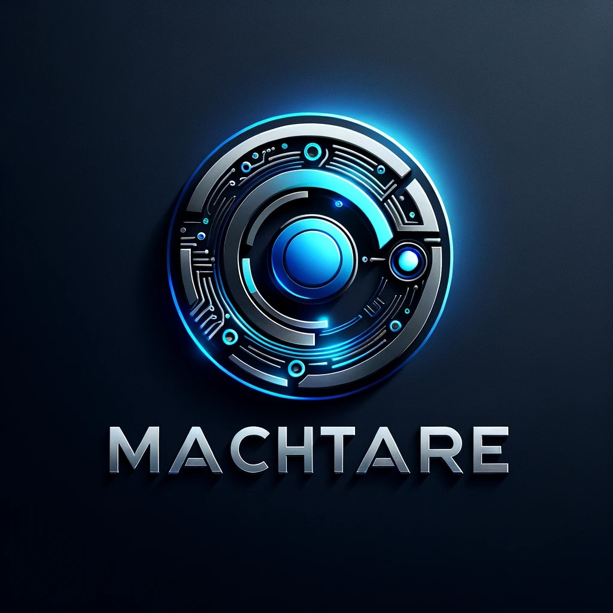

    

"Simplicity is the ultimate sophistication." - Leonardo da Vinci

# Machitare

Machitare is a project exploring what is possible with AI Agents. There are a few areas I intend to explore:

- Recursive breakdown of tasks: Allow agents to recursively breakdown tasks into easier tasks, each layer with its own memory, dynamically resulting in different level of abstraction in task definition and memory
- Real-Time Highly Interactive Agents: Imagine an agent can be interacted with like a person, they can take in new information as they are progressing, or keep working on a task, or even many tasks whilst chatting with the user.
- Video & Audio streaming as the primary communications layer, not text based chat.

I'm starting with the recursive breakdown of tasks and using the GAIA benchmark to see if this approach yields results or not.

## TODO:
- Finish the recursive agent
- Add tools and file processing abilities for the agent 
- Create a simple agent with tool and file processing capabilties
- Benchmark - LLM vs Tools Agent vs Recursive Agent 

## Project Name's Origin

Machitare created by merging the latin words for machine "machina" and to think "cogitare"